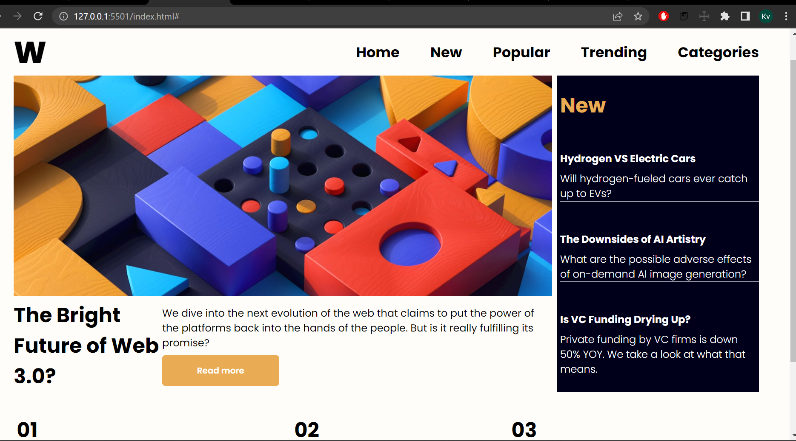
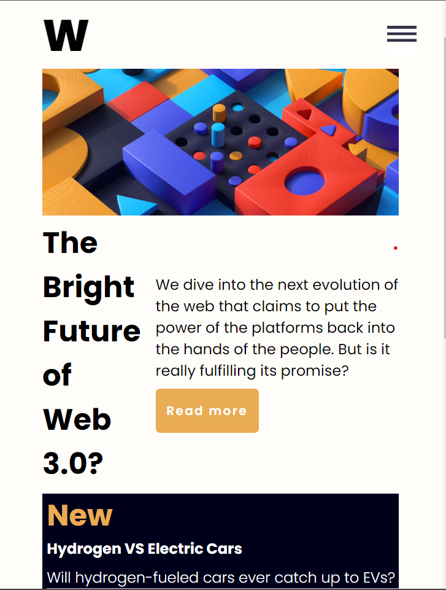
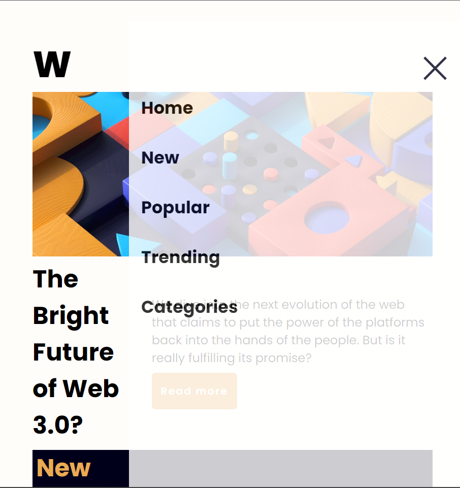

# Frontend Mentor - News homepage solution

This is a solution to the [News homepage challenge on Frontend Mentor](https://www.frontendmentor.io/challenges/news-homepage-H6SWTa1MFl). Frontend Mentor challenges help you improve your coding skills by building realistic projects. 

## Table of contents

- [Overview](#overview)
  - [The challenge](#the-challenge)
  - [Screenshot](#screenshot)
  - [Links](#links)
- [My process](#my-process)
  - [Built with](#built-with)
  - [What I learned](#what-i-learned)
- [Author](#author)

## Overview
  - This is the beginner level project . 
  - skills used :- html5 , css3 , javaScript
### The challenge

Users should be able to:

- View the optimal layout for the interface depending on their device's screen size
- See hover and focus states for all interactive elements on the page

### Screenshot






### Links

- Solution URL: [https://github.com/Keerthivardhan1/news-homepage-main1](https://your-solution-url.com)
- Live Site URL: [Add live site URL here](https://your-live-site-url.com)

## My process
  - responsiveness 
  - navbar - desktop and mobile 

### Built with

- Semantic HTML5 markup
- CSS custom properties
- Flexbox
- Desktop-first workflow

### What I learned
I have learnt how to create responsive navbar and about font-family
```js

togglebtn.addEventListener('click' , ()=>{
    if(menuitems.style.display != "none"){
        togglebtn.style.backgroundImage = "url('icon-menu.svg')";
        togglebtn.style.right =0;
        menuitems.style.display = "none";
        menu.style.background = "none";
    }else{
        menuitems.style.display = "block";
        menu.style.background = "white";
        menu.style.opacity = 0.8;
        menuitems.style.color = "black";
        menu.style.width = "70vw";
        menu.style.height = "100%";
        togglebtn.style.backgroundImage = "url('icon-menu-close.svg')"
    }
    
})
```
## Author

- Linkedin - [KeerthiVardhan](https://www.linkedin.com/in/keerthi-vardhan-tekulapelli-7064a6245/)
- Frontend Mentor - [@Keerthivardhan1](https://www.frontendmentor.io/profile/Keerthivardhan1)
- Twitter - [@vardhan132003](https://www.twitter.com/yourusername)
